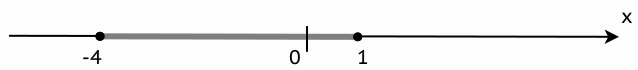

# E4-shootingRangeLevel-1

|Имя входного файла|Имя выходного файла|Ограничение по времени|Ограничение по памяти|
|-|-|-|-|
|стандартный ввод|стандартный вывод|2 секунды|64 мегабайта|

Дан отрезок \[−4;1] на числовой оси. Проверьте, что на нём лежит точка X. Крайние точки принадлежат отрезку.

  

### Формат входных данных
С клавиатуры вводится целое число X (∣X∣ ≤ 105).
### Формат выходных данных
Требуется вывести «1», если точка принадлежит отрезку, и «0», если нет.
### Примеры
|входные данные|выходные данные|
|-|-|
|0|1|
|-5|0|
